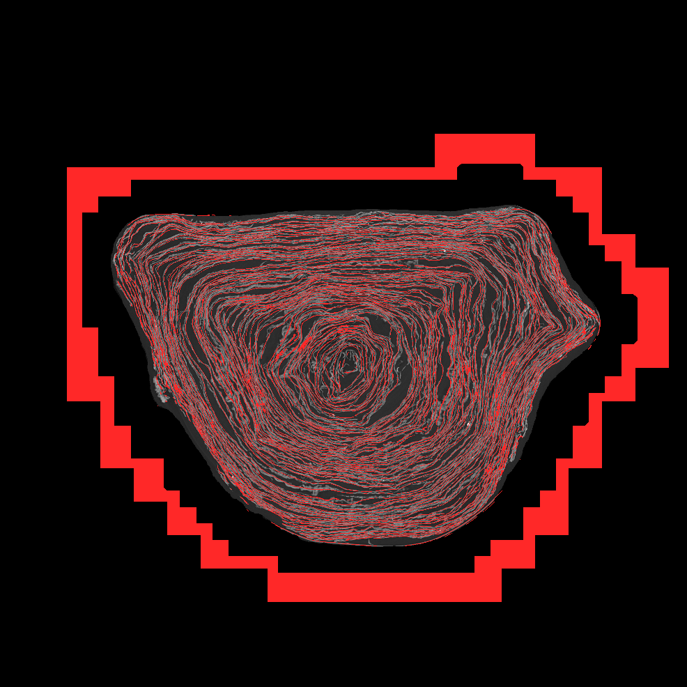
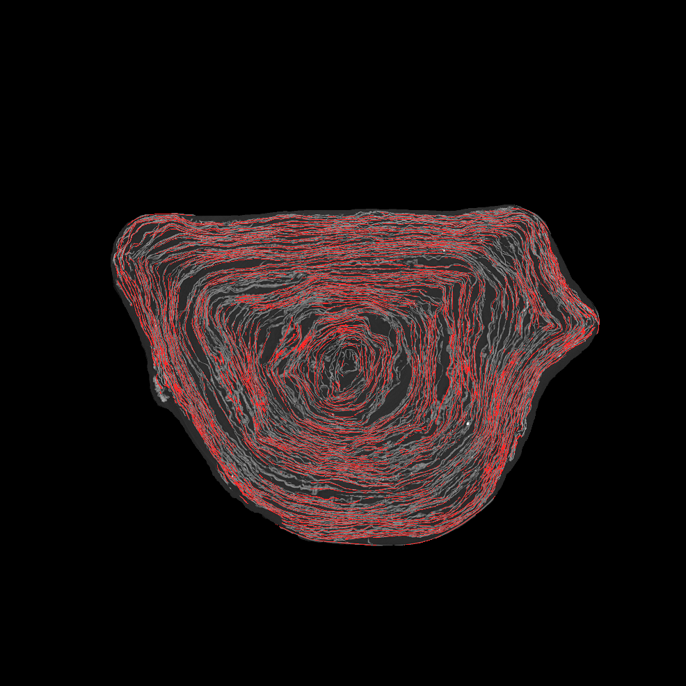
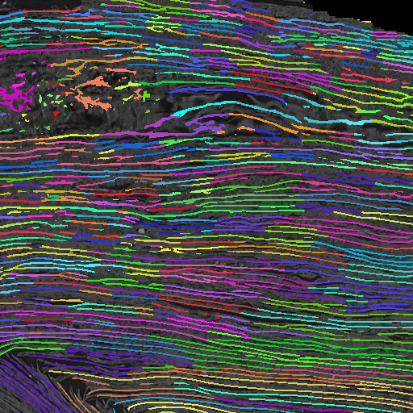
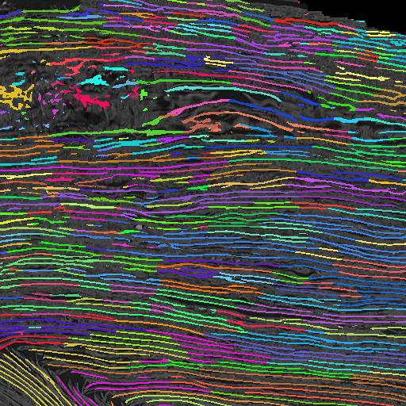
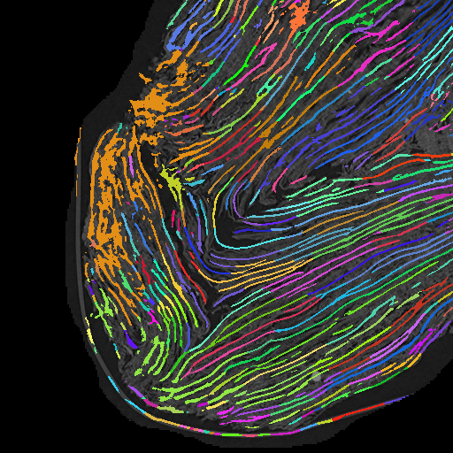
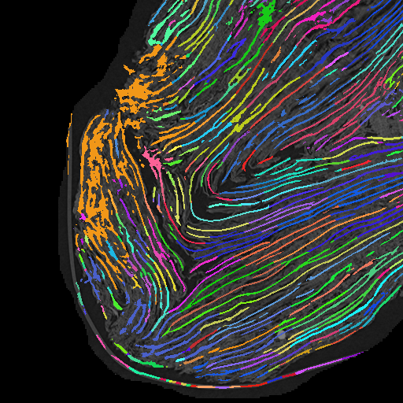
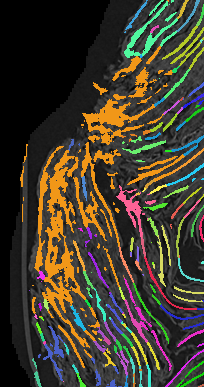
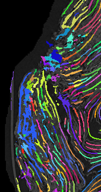
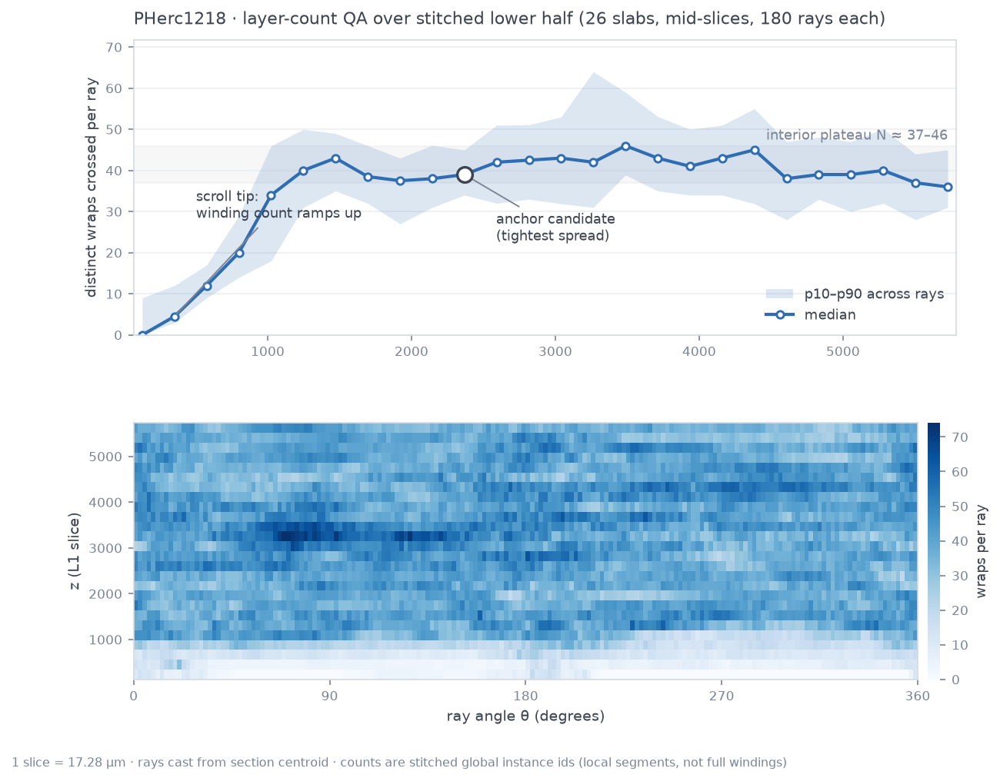

# vesuvius-sheet-tools

CPU-friendly tools for **cleaning and instance-separating surface predictions** of
Herculaneum scrolls ([Vesuvius Challenge](https://scrollprize.org)). Everything
streams from the public S3 bucket — no bulk downloads, no GPU, no credentials.

Motivation: the official surface predictions are a great starting point, but they
contain false positives outside the scroll and merge into a single undifferentiated
mask. Downstream work (segmentation, labeling, virtual unwrapping) needs *clean,
per-sheet* labels. This addresses the label-quality problems described in wishlist
issues [#191](https://github.com/ScrollPrize/villa/issues/191),
[#192](https://github.com/ScrollPrize/villa/issues/192) and
[#193](https://github.com/ScrollPrize/villa/issues/193).

Tested on two scrolls with very different geometry and scan parameters:
**Scroll 3 (PHerc0332**, 2.4 µm, 78 keV**)** and **PHerc1218** (8.6 µm, 116 keV,
heavily compressed, no human segments yet).

## Quick start

```bash
pip install -r requirements.txt
cd scripts

# stream one CT slice of Scroll 3 and save it as PNG (a few MB transferred)
python quickstart_slice.py 4 z

# clean the official surface prediction of PHerc1218 (CT gating + component filter)
python clean_surface_prediction.py pherc1218

# split the cleaned surface mask into individual sheet instances
python separate_sheets.py pherc1218 1

# split fused sheet stacks in the crushed region (CLAHE + tensor normals)
python split_stacked.py pherc1218 1
```

Outputs (renders + `.npy` label crops) land in `output/`.

## Tools

| Script | What it does |
|---|---|
| `quickstart_slice.py` | Stream any pyramid level/slice of a scroll volume to PNG |
| `list_scroll_data.py` | List volumes/segments/predictions available for a sample in S3 |
| `overlay_surface.py` | Overlay official surface predictions on the CT (QC view) |
| `clean_surface_prediction.py` | CT-mask gating + small-component removal for prediction zarrs |
| `separate_sheets.py` | Watershed sheet-instance separation + calibrated over-segmentation merging |
| `split_stacked.py` | Splits fused sheet stacks (watershed mega-instances) in crushed regions using CLAHE + structure-tensor normals |
| `kaggle_stitch_pipeline.py` | Kaggle kernel: whole-scroll processing as overlapping tiles/slabs with instance stitching |
| `assemble_scroll.py` | Local assembly: stitches per-slab outputs across z into one scroll-global instance table |
| `layer_count_qa.py` | Label-free QA: per-ray layer counts over (z,θ) — flags seam errors via count deviations |
| `diagnose_stitch.py` | Classifies stitching disagreement (fixable fragmentation vs genuine ambiguity) |

All tools are multi-scroll: sample configs (volume/prediction URLs and pyramid
alignment) live in the `SCROLLS` dict in `clean_surface_prediction.py` — adding a
scroll is a 6-line entry.

## Method

**Cleaning** (`clean_surface_prediction.py`):
1. Gate predicted voxels by the masked CT (`ct > 0`): removes chunk-aligned false
   positives floating in air outside the scroll.
2. Drop 3D connected components below a voxel threshold (noise specks).

**Sheet separation** (`separate_sheets.py`):
1. Euclidean distance transform (float32) inside the cleaned mask.
2. Seed cores where distance ≥ 2 voxels (deep inside a sheet).
3. Watershed on the negated distance, constrained to the mask → sheet instances.
4. **Merge over-segmented instances**: adjacent instance pairs are merged when the
   mean depth of their shared border is ≥ 0.75× the shallower instance's interior
   depth (90th percentile) — i.e. the watershed cut was artificial. Two guards
   prevent over-merging: borders wider than `MAX_BORDER = 60` voxel pairs are
   rejected (broad contacts run *along* two stacked sheets, artificial cuts run
   *across* one sheet), and unions are capped at 15% of the mask. `MAX_BORDER` was
   calibrated empirically (see below). Union-find applies merges transitively;
   border statistics are accumulated in fixed-size chunks to bound memory.

   *In plain terms*: watershed seeds come from the deep interior of each sheet;
   where a sheet gets thin its seed breaks into pieces, so one physical wrap ends
   up as several instances. For every pair of touching instances we ask: "does
   the border between you look like a real background gap, or like the middle of
   continuous papyrus?" If the border is nearly as deep inside the papyrus as the
   instances' own interiors, the cut was an artifact → merge. The border-size
   guard distinguishes a genuine artificial cut (a small cross-section *through*
   one sheet) from the broad contact area *between* two stacked sheets.

**Splitting fused stacks in crushed regions** (`split_stacked.py`):
In badly crushed regions the watershed itself produces one mega-instance spanning
many physical wraps — merging can't fix that (it only joins labels). The splitter
exploits the fact that stacked sheets usually still show distinct intensity
ridges: (1) per-slice CLAHE amplifies the faint seams; (2) the structure tensor
of the equalized volume gives a sheet-normal per voxel; (3) non-maximum
suppression of intensity *along the normal*, gated by tensor planarity ≥ 0.35,
marks per-sheet centerlines — two fused sheets yield two centerlines; (4)
centerline fragments are consolidated only when they continue each other *along
the sheet plane* (normal alignment ≥ 0.90, displacement ⊥ normal), never across
it; (5) an intensity watershed grows each centerline back to a full sheet, so
boundaries land in the CLAHE valleys (the physical seams).

## Results

### Cleaning (official m7 surface predictions, April 2026)

| Scroll | Predicted voxels in air (removed) | Noise components removed |
|---|---:|---:|
| Scroll 3 (PHerc0332), 64-slice crop @L2 | **65.7%** | 150,463 of 155,652 |
| PHerc1218, 64-slice crop @L3 | **50.0%** | 231,027 of 233,784 |

| Scroll 3 before | Scroll 3 after |
|---|---|
|  |  |

### Sheet separation (PHerc1218, 512×512×128 crops @L1, ~17 µm/voxel)

| Crop | Instances (watershed) | After merge | Largest instance | Merge time |
|---|---:|---:|---:|---:|
| Central (5812,1898,1898) | 491 | 391 | 4.57% of mask | 2.1 s |
| Compressed tip (5812,2320,860) | 401 | 362 | 15.55% of mask* | 1.9 s |

\* pre-existing watershed artifact, not created by merging — see Limitations.

`MAX_BORDER` calibration on the central crop (why 60):

| MAX_BORDER | Instances | Largest instance | Verdict |
|---:|---:|---:|---|
| 1000 | 180 | 14.89% | percolation (chain-merging through compressed stacks) |
| 100 | 304 | 11.84% | one large chain remains |
| 75 | 350 | 7.91% | above target |
| **60** | **391** | **4.57%** | chosen |

Each color below is one sheet instance (papyrus wrap):

| Watershed only | + calibrated merge |
|---|---|
|  |  |

Compressed tip (the hard case):

| Watershed only | + calibrated merge |
|---|---|
|  |  |

Full command-by-command validation logs: the numbers above were reproduced
end-to-end on two independent Python environments (3.11 and 3.14).

### Splitting fused stacks (PHerc1218 crushed tip, 512×512×128 crop @L1)

| Metric | before | after split |
|---|---:|---:|
| Largest instance | 975,704 vox (**15.55%** of mask) | **3.48%** of mask |
| Instances in crop | 362 | 674 |
| Thickness proxy of top-5 split sheets* | — | 4.1 – 5.5 vox |

\* instance volume / centerline voxels ≈ mean sheet thickness. Genuine single
sheets at ~17 µm/voxel measure 4–8; stacked blobs score far higher — this is the
self-check that the big split instances are *long single wraps*, not merged
stacks. ("Smallest largest-instance" alone is misleading once sheets are
legitimately long.)

| Crushed stack (one instance) | After splitting |
|---|---|
|  |  |

## Whole-scroll dataset: PHerc1218 (v1)

The full pipeline ran over the entire scroll (52 slabs of 256 slices, 512² tiles,
~14.5 h of free Kaggle T4): **686,360 sheet-instance segments**, published as a
[Kaggle dataset](https://www.kaggle.com/datasets/iyndopicomartnez/pherc1218-sheet-instance-labels)
(5.1 GB, CC-BY-NC 4.0) with per-tile blocks, global stitch tables and quality
metrics. Stitching uses mutual-best + **directed-coverage** voting in overlap
bands — the directed rule was validated twice: in-plane agreement 59.8%→85.9%
and cross-slab 53.5%→**82.1%** mean (min 76.6%, max 94.1%, 296,771 links).

Label-free QA (layer-count invariant, after Diego-dcv's Obs. 1; ray formulation
ours): any interior cross-section must recover ~the same number of wraps. The
whole-scroll profile reads the scroll's biography — tip ramp, 32–46 wrap
interior plateau, densening to 52 near the base, collapse at the flat end:



## Known limitations

- **Fully fused contacts**: diagnostics in
  [villa #191](https://github.com/ScrollPrize/villa/issues/191) sampled the
  released model's *predicted probability* along the sheet normal at the
  tightest contacts (<4 vox): 78% show a single broad peak and only 0.5% are
  separable — the model's own output cannot be split there, and carving it
  directly hurt topology. This splitter therefore works on the CLAHE-equalized
  *CT intensity* instead — an independent signal, which is how the crushed-tip
  mega-instance resolved. How much of the tightest-contact population the
  intensity signal separates remains to be quantified; truly fused contacts
  will need global priors (spiral structure, winding counts), planned for the
  stitching stage.
- **Crop-local**: instances are labeled per crop; whole-scroll processing needs
  overlapping chunks + instance stitching (planned — a layer-count consistency
  invariant will be used for label-free stitching QA).
- Merging uses border salience only; orientation continuity is not yet a merge
  criterion (it *is* used by the splitter's consolidation).

## Acknowledgements

- **sean (bruniss)** for suggesting CLAHE/windowing to sharpen structure tensors
  in compressed regions — it is what makes the splitter work.
- **nvining** for pushing for a clearer explanation of the merge criterion.
- **Diego-dcv** for the layer-count consistency invariant idea for stitching QA.
- The Vesuvius Challenge team for the open data and the m7 surface predictions.

## Data

All inputs stream from the Vesuvius Challenge open-data bucket
(`s3://vesuvius-challenge-open-data/`, also via HTTPS), licensed
[CC-BY-NC 4.0](https://creativecommons.org/licenses/by-nc/4.0/) by the Vesuvius
Challenge. This repository contains code only (MIT) plus small rendered
illustrations derived from that data.

## License

MIT — see [LICENSE](LICENSE).
